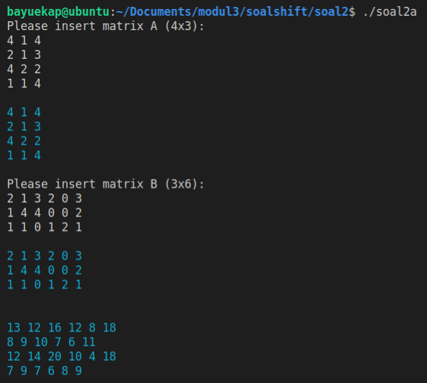
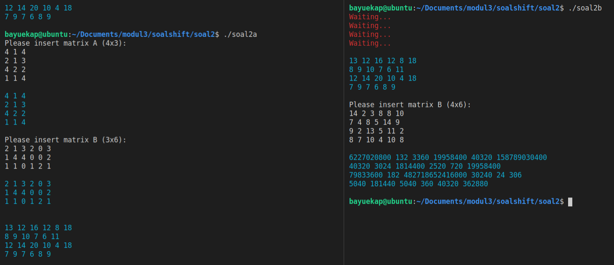
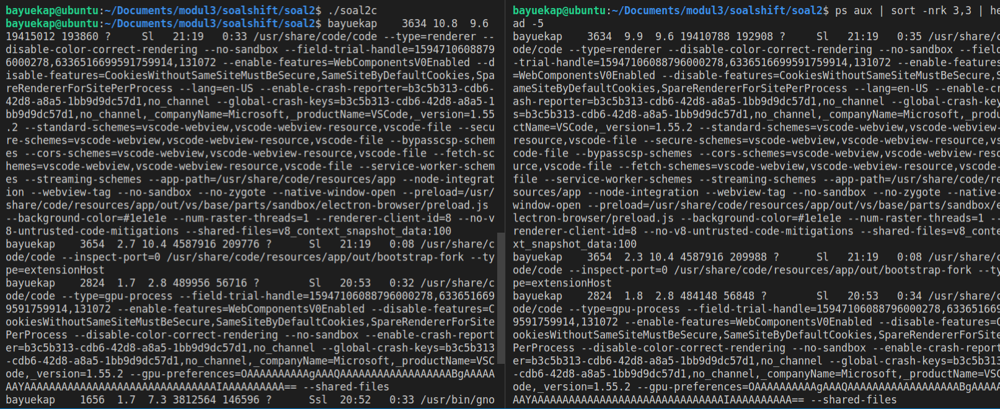
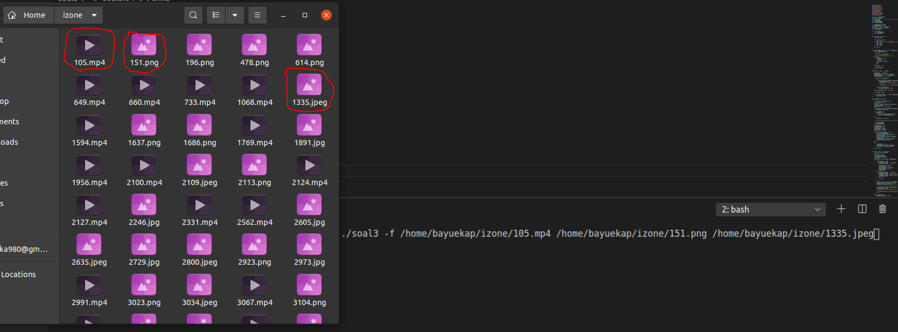
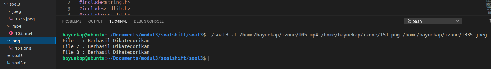
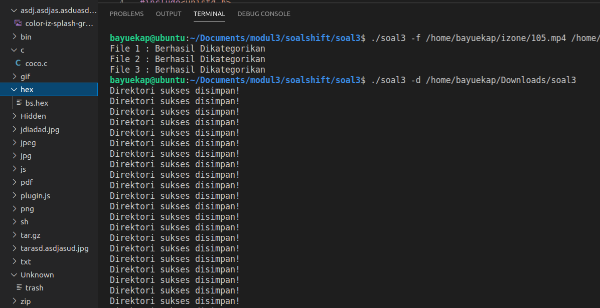
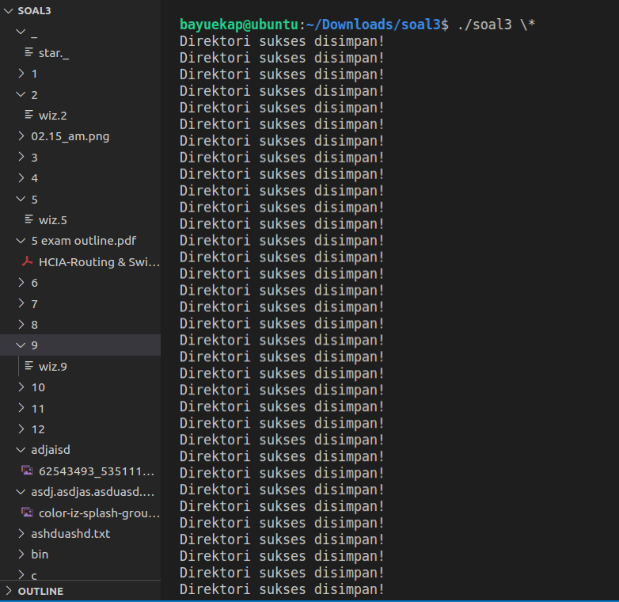

# Soal Shift SISOP modul 3 A02 2021

Anggota Kelompok : 
- Bayu Eka Prawira (05111940000042)
- Putu Ananda Satria Adi (05111940000113)

## Soal 1

### Narasi Soal

Keverk adalah orang yang cukup ambisius dan terkenal di angkatannya. Sebelum dia menjadi ketua departemen di HMTC, dia pernah mengerjakan suatu proyek dimana keverk tersebut meminta untuk membuat server database buku. Proyek ini diminta agar dapat digunakan oleh pemilik aplikasi dan diharapkan bantuannya dari pengguna aplikasi ini.

### 1a

**Soal**</br>
Pada saat client tersambung dengan server, terdapat dua pilihan pertama, yaitu register dan login. Jika memilih register, client akan diminta input id dan passwordnya untuk dikirimkan ke server. User juga dapat melakukan login. Login berhasil jika id dan password yang dikirim dari aplikasi client sesuai dengan list akun yang ada didalam aplikasi server. Sistem ini juga dapat menerima multi-connections. Koneksi terhitung ketika aplikasi client tersambung dengan server. Jika terdapat 2 koneksi atau lebih maka harus menunggu sampai client pertama keluar untuk bisa melakukan login dan mengakses aplikasinya. Keverk menginginkan lokasi penyimpanan id dan password pada file bernama **akun.txt** dengan format:

**akun.txt**

```txt
id:password
id2:password2
```

**Penjelasan**</br>
Karena diminta untuk bisa melayani lebih dari 1 _client_, maka perlu digunakan `select socket`.

**server.c**

```c
int main () {
    fd_set read_fd_set;
    struct sockaddr_in new_addr;
    int server_fd, new_fd, serving = 1;
    int ret_val, ret_val1, ret_val2, ret_val3, status_val;
    char message[SIZE_BUF], id[SIZE_BUF], password[SIZE_BUF], cmd[SIZE_BUF];
    char idpass[256];
    socklen_t addrlen;
    int all_connections[MAX_CONNECTIONS];

    // Make needed files if not found.
    checkFile();

    /* Get the socket server fd */
    server_fd = create_tcp_server_socket();
    if (server_fd == -1) {
        fprintf(stderr, "Failed to create a server\n");
        return -1;
    }

    /* Initialize all_connections and set the first entry to server fd */
    int i;
    for (i = 0; i < MAX_CONNECTIONS; i++) {
        all_connections[i] = -1;
    }
    all_connections[0] = server_fd;

	printf("\nServer is running....\n\n");
    int userLoggedIn = 0;
    while (1) {
        ...
    }

    /* Last step: Close all the sockets */
    for(i=0;i < MAX_CONNECTIONS;i++) {
        if (all_connections[i] > 0) {
            close(all_connections[i]);
        }
    }

    return 0;
}
```

</br>**client.c**

```c
int main () {
    struct sockaddr_in saddr;
    int fd, ret_val;
    struct hostent *local_host; /* need netdb.h for this */
    char message[SIZE_BUF],  cmd[SIZE_BUF];

    /* Step1: create a TCP socket */
    fd = socket(AF_INET, SOCK_STREAM, IPPROTO_TCP);
    if (fd == -1) {
        fprintf(stderr, "socket failed [%s]\n", hstrerror(errno));
        return -1;
    }
    printf("Created a socket with fd: %d\n", fd);

    /* Let us initialize the server address structure */
    saddr.sin_family = AF_INET;
    saddr.sin_port = htons(7000);
    local_host = gethostbyname("127.0.0.1");
    saddr.sin_addr = *((struct in_addr *)local_host->h_addr);
    /* Step2: connect to the TCP server socket */
    ret_val = connect(fd, (struct sockaddr *)&saddr, sizeof(struct sockaddr_in));
    if (ret_val == -1) {
        fprintf(stderr, "Connect failed [%s]\n", hstrerror(errno));
        close(fd);
        return -1;
    }
    ...
}
```

Kedua potongan kode server dan _client_ diatas merupakan template yang diambil dari github modul 3 Sistem Operasi.

Kemudian agar server hanya dapat melayani 1 _client_ dalam satu waktu, maka pada server perlu mengirim pesan kepada _client_ apakah _client_ tersebut sedang dilayani atau tidak. Pesan tersebut akan diterima oleh _client_ dan _client_ akan merespon sesuai pesan terkirim.

**server.c**

```c
int main() {
        ...
                    for (i=0;i < MAX_CONNECTIONS;i++) {
                        if (all_connections[i] < 0) {
                            all_connections[i] = new_fd;

                            // If the server is still serving a client, make other connections wait.
                            if(i != serving) {
                                ret_val1 = send(all_connections[i], "wait",  SIZE_BUF, 0);
                            } else {
                                ret_val1 = send(all_connections[i], "serve",  SIZE_BUF, 0);
                            }
                            break;
                        }
                    }
        ...
}
```

Terdapat variabel `serving` yang menunjukkan _client_ mana yang sedang dilayani saat ini. Jika index dari _client_ tidak sama dengan serving, maka server akan mengirimkan pesan `wait` agar _client_ menunggu giliran. Sebaliknya, jika index _client_ sama dengan serving maka server akan mengirim pesan `serve` agar _client_ dapat mengirimkan pesan ke server. Berikut adalah potongan kode _client_ untuk menerima dan merespon sesuai pesan dari server.

**client.c**

```c
int main() {
    ...
    // Terima msg serve / wait
    ret_val = recv(fd, message, SIZE_BUF, 0);
    while(strcmp(message, "wait") == 0) {
        printf("\e[31mServer is full!\e[0m\n");
        ret_val = recv(fd, message, SIZE_BUF, 0);
    }
    printf("\e[33mServer is now responding to you.\e[0m\n");
    ...
}
```

Setelah _client_ dapat menunggu dan server dapat mengatasi _multi-connections_, tahap selanjutnya adalah untuk dapat menangani `register` dan `login` baik dari sisi server maupun client. Untuk implementasinya cukup simple, pada client akan diminta untuk input baik register maupun login, kemudian perintah tersebut dikirim ke server agar server dapat memproses _request_ tersebut.

**server.c**

```c
int main() {
    ...
        // Receive/read command from client.
        ret_val1 = recv(all_connections[i], cmd, sizeof(cmd), 0);

        ...

        if(!strcmp(cmd, "register")) {
            if(userLoggedIn) {
                continue;
            }

            // Waits for incoming message from client.
            ret_val2 = recv(all_connections[i], id, sizeof(id), 0);
            ret_val3 = recv(all_connections[i], password, sizeof(password), 0);
            if(checkIdentity(0, id, password)) {
                status_val = send(all_connections[serving],
                        "userfound", SIZE_BUF, 0);
            } else {
                userLoggedIn = 1;
                appendAkun(id, password);
                status_val = send(all_connections[serving],
                        "regloginsuccess", SIZE_BUF, 0);
                sprintf(idpass, "%s:%s", id, password);
            }
        } else if(!strcmp(cmd, "login")) {
            if(userLoggedIn) {
                // printf("\e[32mYou already logged in!\n");
                continue;
            }

            // Waits for incoming message from client.
            ret_val2 = recv(all_connections[i], id, sizeof(id), 0);
            ret_val3 = recv(all_connections[i], password, sizeof(password), 0);
            if(!checkIdentity(1, id, password))
                status_val = send(all_connections[serving],
                        "wrongpass", SIZE_BUF, 0);
            else {
                userLoggedIn = 1;
                status_val = send(all_connections[serving],
                        "regloginsuccess", SIZE_BUF, 0);
                sprintf(idpass, "%s:%s", id, password);
            }
        }
    ...
}

/*
Check if id and password exists in akun.txt
Mode 0 for register, 1 for login.
Returns 1 if it does, else returns 0.
*/
int checkIdentity(int mode, char id[], char password[]){
    char akun[100], temp[100];
    FILE *fp = fopen("akun.txt", "r");
    if(mode)
        sprintf(akun, "%s:%s", id, password);
    else
        sprintf(akun, "%s:", id);

    // Loop per line
    while(fscanf(fp, "%s", temp) == 1){
        // Cek apakah id:password sudah ada.
        if(strstr(temp, akun)!=0) {
                fclose(fp);
                return 1;
        }
    }
    fclose(fp);
    return 0;
}
```

Potongan kode diatas merupakan bagaimana server meng-_handle_ request register/login yang dikirim oleh client. Digunakan fungsi `checkIdentity` untuk membantu mengecek apakah ID dan password yang dimasukkan sudah benar atau belum.

**client.c**

```c
int main() {
    ...
        while(!commandTrue) {
            recieveInput("Insert Register/Login", cmd);
            for(b = 0; b < strlen(cmd); b++){
                cmd[b] = tolower(cmd[b]);
            }
            ret_val = send(fd, cmd, sizeof(cmd), 0);
            if(!strcmp(cmd, "register") || !strcmp(cmd, "login")) {
                if(handleRegLog(fd, cmd)) {
                    commandTrue = 1;
                    break;
                }
            } else {
                ret_val = recv(fd, message, SIZE_BUF, 0);
                if(!strcmp(message, "notlogin")) {
                    printf("\e[31mAccess restricted!\nPlease register/login.\e[0m\n");
                } else {
                    commandTrue = 1;
                }
            }
        }
    ...
}

/*
Handle the register and login of client.
*/
int handleRegLog(int fd, char cmd[]) {
    int ret_val, isFound = 0;
	char id[SIZE_BUF], password[SIZE_BUF], message[SIZE_BUF];

    recieveInput("Enter Username", id);
    recieveInput("Enter Password", password);

    ret_val = send(fd, id, sizeof(id), 0);
    ret_val = send(fd, password, sizeof(id), 0);

    ret_val = recv(fd, message, SIZE_BUF, 0);
    puts(message);

    //check if its terminate condition
    if(!strcmp(message, "regloginsuccess")){
        return 1;
    }
    else if(!strcmp(message, "userfound")) {
        printWarn("Username or ID already exist!");
        return 0;
    }
    else if(!strcmp(message, "wrongpass")) {
        printWarn("ID or Password doesn't match!");
        return 0;
    }

}
```

Potongan kode diatas merupakan impelementasi untuk user register dan login pada client. Dapat dilihat dalam fungsi main, pengguna akan terus diminta untuk memasukkan register dan login selama user belum login sehingga user tidak dapat menggunakan perintah lain selain register dan login.

</br>

### 1b

**Soal**</br>
Sistem memiliki sebuah database yang bernama **files.tsv**. Isi dari **files.tsv** ini adalah **path file saat berada di server, publisher,** dan **tahun publikasi**. Setiap penambahan dan penghapusan file pada folder file yang bernama **FILES** pada server akan memengaruhi isi dari **files.tsv**. Folder **FILES** otomatis dibuat saat server dijalankan.
</br>

**Penjelasan**</br>
Langakah pertama yang harus dijalankan adalah mengecek apakah file files.tsv dan folder FILES sudah ada atau belum. Jika belum, maka kedua file tersebut akan dibuat dengan cara sebagai berikut:

**server.c**

```c
void checkFile() {
    ...

    if(access("files.tsv", F_OK )) {
		FILE *fp = fopen("files.tsv", "w+");
        fprintf(fp, "FilePath\tPublisher\tTahun Publikasi\n");
		fclose(fp);
	}

    ...

    struct stat stats;
    stat("./FILES", &stats);

    if(!S_ISDIR(stats.st_mode))
        mkdir("./FILES", 0777);
}
```

Dari potongan kode diatas, pertama dilakukan pengecekan apakah files.tsv sudah ada, jika belum maka akan dibuat dengan `fopen("files.tsv", "w+")` kemudian kita print header dari files.tsv tersebut, lalu file ditutup. Dilakukan juga pengecekan terhadap folder FILES, jika belum ada maka folder dibuat dengan `mkdir("./FILES", 0777)`

</br>

### 1c

**Soal**</br>
Tidak hanya itu, Keverk juga diminta membuat fitur agar client dapat menambah file baru ke dalam server. Direktori FILES memiliki struktur direktori di bawah ini :

Direktori FILES

```txt
File1.ekstensi
File2.ekstensi
```

Pertama client mengirimkan input ke server dengan struktur sebagai berikut :
ontoh Command Client :

```txt
add
```

Output Client Console:

```txt
Publisher:
Tahun Publikasi:
Filepath:
```

Kemudian, dari aplikasi client akan dimasukan data buku tersebut (perlu diingat bahwa Filepath ini merupakan path file yang akan dikirim ke server). Lalu client nanti akan melakukan pengiriman file ke aplikasi server dengan menggunakan socket. Ketika file diterima di server, maka row dari files.tsv akan bertambah sesuai dengan data terbaru yang ditambahkan.
</br>

**Penjelasan**</br>
Pada stage ini server sudah mampu menerima command apapun dari client, karena server akan menerima command apapun yang diberikan. Kita menambahkan _string compare_ untuk command add, kemudian juga mendefinisikan fungsi `addCommand`.

**server.c**

```C
char *strrev(char *str) {
    char *p1, *p2;

    if (! str || ! *str)
        return str;
    for (p1 = str, p2 = str + strlen(str) - 1; p2 > p1; ++p1, --p2) {
        *p1 ^= *p2;
        *p2 ^= *p1;
        *p1 ^= *p2;
    }
    return str;
}

void getFileName(char path[], char filename[]) {
    int i = strlen(path) - 1;
    int j = 0;
    // int len = strlen(path) - 1;
    // char temp[strlen(path)];
    while(i) {
        path[i+1] = '\0';
        if(path[i] == '/')
            break;
        filename[j] = path[i];
        i--;
        j++;
    }
    filename[j] = '\0';

    strrev(filename);
}

int main() {
    ...

        if(userLoggedIn) {
            if(!strcmp(cmd, "add")) {
                addCommand(all_connections[serving], idpass);
            }

            ...

        }

    ...
}

void addCommand(int client, char idpass[128]) {
    char publisher[SIZE_BUF], tahun[SIZE_BUF],
         filepath[SIZE_BUF], filename[SIZE_BUF],
         message[SIZE_BUF];
    int ret_pub, ret_year, ret_fp, ret_stat;
    ret_pub = recv(client, publisher, sizeof(publisher), 0);
    ret_year = recv(client, tahun, sizeof(tahun), 0);
    ret_fp = recv(client, filepath, sizeof(filepath), 0);
    int ret_rec;
    char fullpath[256];
    char data[FILE_SEND_BUF];

    getFileName(filepath, filename);
    sprintf(fullpath, "%s%s", SERVERPATH, filename);

    FILE *tsv = fopen("files.tsv", "a");
    fprintf(tsv, "%s\t%s\t%s\n", fullpath, publisher, tahun);
    fclose(tsv);

    // recvFile(client, filename);
    FILE *file = fopen(fullpath, "w+");
    while(1) {
        ret_rec = recv(client, data, FILE_SEND_BUF, 0);
        printf("Data Begin -%s- Data End\n", data);
        fflush(stdout);
        if(ret_rec != -1) {
            if(!strcmp(data, "done")) {
                break;
            }
        }
        fprintf(file, "%s", data);
        bzero(data, FILE_SEND_BUF);
    }
    fclose(file);
}
```

Dalam fungsi `addCommand`, server akan bersiap menerima data **filepath, publisher, dan tahun** buku dari client. Setelah data tersebut diterima oleh server maka filename akan dicari dengan menggunakan bantuan fungsi `getFileName`. Setelah mendapatkan filename, kita dapat menambahkan data yang didapatkan tadi ke `files.tsv`. Barulah proses transfer file akan dilakukan, pertama dibuat file sesuai dengan path server dan filename yang didapatkan. Dilakukan while loop selama client masih mengirimkan data, hingga ditemukan message '**done**' yang menunjukkan client selesai mengirimkan data.  
</br>
Kemudian pada client, jika user menggunakan command add, maka client akan meminta input berupa filepath, publisher, dan tahun kepada user. Setelah data dimasukkan, maka data tersebut akan dikirim ke server. Selanjutnya, filepath dibuka menggunakan **fopen** dengan mode read, yang semua datanya akan dikirimkan ke server agar server dapat menerima data file tersebut.

**client.c**

```c
int main() {
    ...
        if(!strcmp(cmd, "add")) {
            sendFile(fd);
        }
    ...
}

void sendFile(int fd) {
    int ret_val;
    char publisher[SIZE_BUF], tahun[SIZE_BUF], filepath[SIZE_BUF];

    recieveInput("Publisher", publisher);
    recieveInput("Tahun Publikasi", tahun);
    recieveInput("Filepath", filepath);

    ret_val = send(fd, publisher, sizeof(publisher), 0);
    ret_val = send(fd, tahun, sizeof(tahun), 0);
    ret_val = send(fd, filepath, sizeof(filepath), 0);

    FILE *book = fopen(filepath, "r");
    char data[FILE_SEND_BUF];

    while(fgets(data, FILE_SEND_BUF, book) != NULL) {
        // printf("\e[35m[Sending]\e[33m %s\e[0m", data);
        if(send(fd, data, sizeof(data), 0) != -1) {
            bzero(data, FILE_SEND_BUF);
        }
    }
    fclose(book);
    printf("\e[32mFile sent!\e[0m\n");
    send(fd, "done", FILE_SEND_BUF, 0);
}
```

### 1d

**Soal**</br>
Dan client dapat mendownload file yang telah ada dalam folder **FILES** di server, sehingga sistem harus dapat mengirim file ke client. Server **harus** melihat dari files.tsv untuk melakukan pengecekan apakah file tersebut valid. Jika tidak valid, maka mengirimkan pesan error balik ke client. Jika berhasil, file akan dikirim dan akan diterima ke client di **folder client** tersebut.

Contoh Command client

```txt
download TEMPfile.pdf
```

**Penjelasan**</br>
Untuk dapat mendownload file yang telah ada dalam folder FILES di server, serta melakukan pengecekan apakah file tersebut ada dalam files.tsv, implementasinya adalah sebagai berikut:

**server.c**

```c
int main() {
    ...

        if(userLoggedIn) {
            ...

            if(!strcmp(cmd, "download")) {
                downloadCommand(all_connections[serving]);
            }

            ...

        }

    ...
}

void downloadCommand(int client) {
    char fullpath[256], filename[128];

    int ret_fp;
    ret_fp = recv(client, filename, sizeof(filename), 0);

    sprintf(fullpath, "%s%s", SERVERPATH, filename);
    // printf("%s\n", fullpath);

    if(findFile(filename)) {
        FILE *book = fopen(fullpath, "r");
        char data[FILE_SEND_BUF];

        while(fgets(data, FILE_SEND_BUF, book) != NULL) {
            // printf("\e[35m[Sending]\e[33m %s\e[0m", data);
            if(send(client, data, sizeof(data), 0) != -1) {
                bzero(data, FILE_SEND_BUF);
            }
        }
        fclose(book);
        printf("\e[32mFile sent!\e[0m\n");
        send(client, "done", FILE_SEND_BUF, 0);
    } else {
        send(client, "err404", FILE_SEND_BUF, 0);
    }
}

int findFile(char filename[]) {
    FILE *tsv = fopen("files.tsv", "r");
    char temp[256];

    while(fscanf(tsv,"%s", temp) == 1) {
        if(strstr(temp, filename)!=0) {
            fclose(tsv);
            return 1;
        }
    }
    fclose(tsv);
    return 0;
}
```

Server akan menerima nama file yang akan didownload oleh client. Dalam files.tsv akan dicek apakah terdapat nama file tersebut, jika tidak maka server akan mengirimkan pesan error, sedangkan jika benar maka file tersebut akan dibuka dan dikirimkan kepada user menggunakan algoritma yang sama dengan addCommand.  
</br>
Pada sisi client, akan diminta user input berupa nama file yang akan di-download yang kemudian dikirimkan ke server. Setelah dikirimkan, client akan menunggu respon dari server. Jika respon server error, maka client tidak akan menerima data lain lagi. Sedangkan jika server merespon dengan data, maka proses download file akan berjalan hingga ditemukan message done.
</br>

**client.c**

```c
int main() {
    ...
        if(!strcmp(cmd, "download")) {
            downloadBook(fd);
        }
    ...
}

void recvFile(int server, char filename[]) {
    int ret_rec;
    char fullPath[100] = {0};
    char data[FILE_SEND_BUF];

    sprintf(fullPath, "%s%s", CLIENTPATH, filename);
    FILE *file = fopen(fullPath, "w");
    fclose(file);
    while(1) {
        file = fopen(fullPath, "a");
        if(recv(server, data, sizeof(data), 0) != -1) {
            if(!strcmp(data, "err404")) {
                printf("\e[31mFile not found!\e[0m\n");
                return;
            }
            if(!strcmp(data, "done")) {
                printf("\e[32mFile downloaded!\e[0m\n");
                return;
            }

            // printf("\e[35m[Recieved]\e[33m %s\e[0m", data);
            fprintf(file, "%s", data);
            bzero(data, FILE_SEND_BUF);
        }
        fclose(file);
    }
}

void downloadBook(int fd) {
    int ret_val;
    char filename[SIZE_BUF];

    recieveInput("Masukkan nama file", filename);

    ret_val = send(fd, filename, sizeof(filename), 0);

    recvFile(fd, filename);
}
```

### 1e

**Soal**</br>
Setelah itu, client juga dapat menghapus file yang tersimpan di server. Akan tetapi, Keverk takut file yang dibuang adalah file yang penting, maka file hanya akan diganti namanya menjadi ‘old-NamaFile.ekstensi’. Ketika file telah diubah namanya, maka row dari file tersebut di file.tsv akan terhapus.

Contoh Command Client:

```txt
delete TEMPfile.pdf
```

</br>

**Penjelasan**</br>
Pada poin ini, diminta untuk menerima command delete dari client, namun file tidak benar-benar dihapus, hanya direname menjadi `old-NamaFile.ekstensi`. Kemudian row dari file tersebut akan dihapus.
</br>
Hal pertama yang harus dilakukan adalah melakukan pengecekan pada files.tsv apakah file yang ingin dihapus ada. Sembari mencari file tersebut, jika pada filepath tidak mengandung nama file yang ingin dihapus maka akan diprint ke temp.tsv. Jika filepath mengandung nama file tersebut maka tidak diprint. Pada akhir fungsi temp.tsv akan direname menjadi files.tsv karena temp.tsv sudah tidak mengandung nama file yang dihapus.
</br>
**server.c**

```c
int findLine(int *found, char filename[]) {
    FILE *tsv = fopen("files.tsv", "r+");
    FILE *tmp = fopen("temp.tsv", "w+");
    char temp[256], line[256], tsvPath[256], tempPath[256];

    while(fgets(line, 256, tsv) != 0) {
        // Cek apakah id:password sudah ada.
        if(sscanf(line, "%255[^\n]", temp) != 1) break;
        if(strstr(temp, filename) != 0) {
            *found = 1;
        } else {
            fprintf(tmp, "%s\n", temp);
        }
    }
    remove("files.tsv");
    rename("temp.tsv", "files.tsv");

    fclose(tmp);
    fclose(tsv);
    return 0;
}
```

Setelah row file ditemukan dan dihapus dari files.tsv kemudian file tersebut dapat direname menjadi `old-NamaFile.ekstensi`. Sehingga keseluruhan kode menjadi:

**server.c**

```c
int main() {
    ...

        if(userLoggedIn) {
            ...

            if(!strcmp(cmd, "delete")) {
                deleteCommand(all_connections[serving]);
            }

            ...

        }

    ...
}

void deleteCommand(int client, char idpass[128]) {
    int ret_client, found = 0;
    char filename[128], newPath[256], oldpath[256];

    ret_client = recv(client, filename, sizeof(filename), 0);

    findLine(&found, filename);
    if(found) {
        ret_client = send(client, "done", SIZE_BUF, 0);
        sprintf(newPath, "%sold-%s", SERVERPATH, filename);
        sprintf(oldpath, "%s%s", SERVERPATH, filename);
        rename(oldpath, newPath);
    } else {
        ret_client = send(client, "notfound", SIZE_BUF, 0);
    }
}
```

Pada sisi client, implementasi cukup simple. User akan diminta input berupa nama file yang ingin dihapus yang kemudian dikirimkan ke server. Setelah itu client menunggu respon dari server apakah file berhasil dihapus atau file tidak ditemukan.

**client.c**

```c
int main() {
    ...
        if(!strcmp(cmd, "delete")) {
            deleteBook(fd);
        }
    ...
}

void deleteBook(int fd) {
    int ret_val;
    char filename[SIZE_BUF], resp[SIZE_BUF];

    recieveInput("Masukkan nama file", filename);

    ret_val = send(fd, filename, sizeof(filename), 0);

    ret_val = recv(fd, resp, SIZE_BUF, 0);
    if(!strcmp(resp, "done")) {
        printf("\e[32mFile Deleted!\e[0m\n");
    }

    if(!strcmp(resp, "notfound")) {
        printf("\e[31mFile Not Found!\e[0m\n");
    }
}
```

### 1f

**Soal**</br>
Client dapat melihat semua isi files.tsv dengan memanggil suatu perintah yang bernama see. Output dari perintah tersebut keluar dengan format.

Contoh Command Client :

```txt
see
```

Contoh Format Output pada Client:

```txt
Nama:
Publisher:
Tahun publishing:
Ekstensi File :
Filepath :

Nama:
Publisher:
Tahun publishing:
Ekstensi File :
Filepath :
```

</br>

**Penjelasan**</br>
Pada soal ini, diminta untuk menampilkan semua isi dari files.tsv dengan format yang sudah ditentukan.  
</br>
Pertama, files.tsv dibuka dengan mode read lalu di-read per line menggunakan fgets. Setelah satu line didapatkan, maka semua akan dipisahkan satu persatu menjadi filepath, publisher, tahun, nama, dst. Setelah dipisahkan, semua data dapat dikirimkan ke client untuk selanjutnya di-print.

**server.c**

```c
int main() {
    ...
        if(!strcmp(cmd, "see")) {
            seeCommand(fd);
        }
    ...
}

void seeCommand(int client) {
    FILE *book = fopen("files.tsv", "r");
    char data[FILE_SEND_BUF], file[64], filename[64], pub[64],
         tahun[64], eks[64], filepath[256];
    char temp[FILE_SEND_BUF];

    int i = 0;
    char *p;
    while(fgets(data, FILE_SEND_BUF, book) != NULL) {
        if(i != 0) {
            strcpy(filepath, strtok_r(data, "\t", &p));
            strcpy(pub, strtok_r(NULL, "\t", &p));
            strcpy(tahun, strtok_r(NULL, "\t", &p));
            tahun[strlen(tahun)-1] = '\0';

            getFileName(filepath, file);

            strcpy(filename, strtok_r(file, ".", &p));
            strcpy(eks, strtok_r(NULL, ".", &p));

            bzero(data, FILE_SEND_BUF);

            sprintf(temp, "Nama: %s\n", filename);
            strcat(data, temp);
            sprintf(temp, "Publisher: %s\n", pub);
            strcat(data, temp);
            sprintf(temp, "Tahun Publishing: %s\n", tahun);
            strcat(data, temp);
            sprintf(temp, "Ekstensi File: %s\n", eks);
            strcat(data, temp);
            sprintf(temp, "Filepath: %s%s.%s\n", filepath, file, eks);
            strcat(data, temp);

            send(client, data, sizeof(data), 0);

            int j;
        }
        i++;
        bzero(data, sizeof(data));
    }
    send(client, "done", sizeof("done"), 0);

    fclose(book);
}
```

Sedangkan untuk di client, client hanya perlu meng-print data yang diterima dari server.

**client.c**

```c
int main() {
    ...
        if(!strcmp(cmd, "see")) {
            getBookList(fd);
        }
    ...
}

void getBookList(int server) {
    int server_val;
    char data[FILE_SEND_BUF];

    while(1) {
        server_val = recv(server, data, sizeof(data), 0);
        if(!strcmp(data, "done")) break;
        printf("\n\e[33m%s\e[0m", data);
    }
}
```

### 1g

**Soal**</br>
Aplikasi client juga dapat melakukan pencarian dengan memberikan suatu string. Hasilnya adalah semua nama file yang mengandung string tersebut. Format output seperti format output f.

Contoh Client Command:

```txt
find TEMP
```

</br>

**Penjelasan**</br>
Untuk menyelesaikan poin ini, hanya diperlukan sedikit modifikasi dari poin 1f. Pada server saat looping dalam files.tsv, data akan dikirim hanya jika nama file mengandung string yang dicari.

**server.c**

```c
int main() {
    ...
        if(!strcmp(cmd, "find")) {
            findCommand(fd);
        }
    ...
}

void findCommand(int client) {
    FILE *book = fopen("files.tsv", "r");
    char data[FILE_SEND_BUF], file[64], filename[64], pub[64],
         tahun[64], eks[64], filepath[256];

    char temp[FILE_SEND_BUF], fileToFind[FILE_SEND_BUF];

    int client_val;

    client_val = recv(client, fileToFind, FILE_SEND_BUF, 0);

    int i = 0;
    char *p;
    while(fgets(data, FILE_SEND_BUF, book) != NULL) {
        if(i != 0) {
            strcpy(filepath, strtok_r(data, "\t", &p));
            strcpy(pub, strtok_r(NULL, "\t", &p));
            strcpy(tahun, strtok_r(NULL, "\t", &p));
            tahun[strlen(tahun)-1] = '\0';

            getFileName(filepath, file);

            strcpy(filename, strtok_r(file, ".", &p));
            strcpy(eks, strtok_r(NULL, ".", &p));

            bzero(data, FILE_SEND_BUF);

            if(strstr(filename, fileToFind) != NULL) {
                sprintf(temp, "Nama: %s\n", filename);
                strcat(data, temp);
                sprintf(temp, "Publisher: %s\n", pub);
                strcat(data, temp);
                sprintf(temp, "Tahun Publishing: %s\n", tahun);
                strcat(data, temp);
                sprintf(temp, "Ekstensi File: %s\n", eks);
                strcat(data, temp);
                sprintf(temp, "Filepath: %s%s.%s\n", filepath, file, eks);
                strcat(data, temp);

                send(client, data, sizeof(data), 0);
            }

            int j;
        }
        i++;
        bzero(data, sizeof(data));
    }
    send(client, "done", sizeof("done"), 0);

    fclose(book);
}
```

Sedangkan untuk client tetap sama, hanya meng-print data yang diterima dari server.

**client.c**

```c
int main() {
    ...
        if(!strcmp(cmd, "find")) {
            findBook(fd);
        }
    ...
}

void findBook(int server) {
    int server_val;
    char data[FILE_SEND_BUF], bookName[FILE_SEND_BUF];

    recieveInput("Inser Book Name to Find", bookName);

    server_val = send(server, bookName, FILE_SEND_BUF, 0);

    while(1) {
        server_val = recv(server, data, sizeof(data), 0);
        if(!strcmp(data, "done")) break;
        printf("\n\e[33m%s\e[0m", data);
    }
}
```

### 1h

**Soal**</br>
Dikarenakan Keverk waspada dengan pertambahan dan penghapusan file di server, maka Keverk membuat suatu log untuk server yang bernama running.log. Contoh isi dari log ini adalah

running.log

```txt
Tambah : File1.ektensi (id:pass)
Hapus : File2.ektensi (id:pass)
```

</br>

**Penjelasan**</br>
Untuk menyelesaikan soal ini, pertama dibuat file running.log pada fungsi `checkFile`. Kemudian pada fungsi `addCommand` dan `deleteCommand` tambahkan potongan kode yang sesuai sebagai berikut.

```c
void checkFile() {
    ...

    if(access("running.log", F_OK )) {
		FILE *fp = fopen("running.log", "w+");
		fclose(fp);
	}

    ...
}

void addCommand(int client, char idpass[128]) {

    ...

    FILE *log = fopen("running.log", "a");
    fprintf(log, "Tambah : %s (%s)\n", filename, idpass);
    fclose(log);
}

void deleteCommand(int client, char idpass[128]) {

    ...

    FILE *log = fopen("running.log", "a");
    fprintf(log, "Hapus : %s (%s)\n", filename, idpass);
    fclose(log);
}
```

# Soal 2

Crypto (kamu) adalah teman Loba. Suatu pagi, Crypto melihat Loba yang sedang kewalahan mengerjakan tugas dari bosnya. Karena Crypto adalah orang yang sangat menyukai tantangan, dia ingin membantu Loba mengerjakan tugasnya. Detil dari tugas tersebut adalah:

## 2a

Membuat program perkalian matrix (4x3 dengan 3x6) dan menampilkan hasilnya. Matriks nantinya akan berisi angka 1-20 (tidak perlu dibuat filter angka)

## Jawaban

Pada soal ini, kita diminta untuk mengalikan matriks 4x3 dengan matriks 3x6, yang menghasilkan matriks 4x6 berdasarkan operasi matematika matriks. Untuk programnya, kita menginisialisasi dahulu matriks 4x3 (array 2 dimensi), lalu mengisinya dengan angka-angka, lalu menginisialisasi matriks 3x6 (array 2 dimensi), lalu mengisinya dengan angka.

```C
int main()
{
    ...
    printf("Please insert matrix A (4x3):\n");
    for(int i = 0; i < 4; i++) {
        for(int j = 0; j < 3; j++) {
            scanf("%lld", &matA[i][j]);
        }
    }

    printMatrix(4, 3, matA);

    printf("Please insert matrix B (3x6):\n");
    for(int i = 0; i < 3; i++) {
        for(int j = 0; j < 6; j++) {
            scanf("%lld", &matB[i][j]);
        }
    }

    printMatrix(3, 6, matB);
    ...
}
```

Setelah itu memanggil fungsi mulMatrix untuk mengalikan kedua matriks tersebut dan disimpan ke dalam variabel matC yang sebelumnya diinisialisasi dengan shared memory, yang shared memory ini digunakan untuk mentransfer output perkalian matriks ini menjadi input pada program soal 2b.

```C
void mulMatrix(int rowA, int colA, ll matA[rowA][colA],
                int rowB, int colB, ll matB[rowB][colB],
                ll matC[rowA][colB]) {
    int temp = 0;
    for(int i = 0; i < rowA; i++) {
        for(int j = 0; j < colB; j++) {
            for(int k = 0; k < colA; k++) {
                matC[i][j] += matA[i][k] * matB[k][j];
            }
        }
    }
}

int main()
{
    key_t kunci = 6969;
    void *mem;
    ll matA[4][3], matB[3][6];

    int shmid = shmget(kunci, 512, IPC_CREAT | 0666);
    mem = shmat(shmid, NULL, 0);

    ll (*matC)[6] = mem;
    memset(matC, 0, sizeof(int));
}
```

Untuk mentransfer hasilnya tersebut, kita memasang flag sebagai penanda agar program soal 2b bisa menerima hasil inputan tersebut.

```C
int main()
{
    ...
    matC[5][0] = 1;
    ...
}
```

## Kode Program

```C
#include <stdio.h>
#include <string.h>
#include <time.h>
#include <unistd.h>
#include <sys/ipc.h>
#include <sys/shm.h>

typedef long long ll;

void mulMatrix(int rowA, int colA, ll matA[rowA][colA],
                int rowB, int colB, ll matB[rowB][colB],
                ll matC[rowA][colB]) {
    int temp = 0;
    for(int i = 0; i < rowA; i++) {
        for(int j = 0; j < colB; j++) {
            for(int k = 0; k < colA; k++) {
                matC[i][j] += matA[i][k] * matB[k][j];
            }
        }
    }
}

void printMatrix(int row, int col, ll matrix[row][col]) {
    printf("\e[36m");
    printf("\n");
    for(int i = 0; i < row; i++) {
        for(int j = 0; j < col; j++) {
            printf("%lld ", matrix[i][j]);
        }
        printf("\n");
    }
    printf("\n\e[0m");
}

int main(int argc, char *argv[]) {
    key_t kunci = 6969;
    void *mem;
    ll matA[4][3], matB[3][6];

    int shmid = shmget(kunci, 512, IPC_CREAT | 0666);
    mem = shmat(shmid, NULL, 0);

    ll (*matC)[6] = mem;
    memset(matC, 0, sizeof(int));

    printf("Please insert matrix A (4x3):\n");
    for(int i = 0; i < 4; i++) {
        for(int j = 0; j < 3; j++) {
            scanf("%lld", &matA[i][j]);
        }
    }

    printMatrix(4, 3, matA);

    printf("Please insert matrix B (3x6):\n");
    for(int i = 0; i < 3; i++) {
        for(int j = 0; j < 6; j++) {
            scanf("%lld", &matB[i][j]);
        }
    }

    printMatrix(3, 6, matB);

    mulMatrix(4, 3, matA, 3, 6, matB, matC);

    printMatrix(4, 6, matC);

    // sleep(5);

    matC[5][0] = 1;

    shmdt(mem);
    shmctl(shmid, IPC_RMID, NULL);
}
```

## Output
 

## 2b

Membuat program dengan menggunakan matriks output dari program sebelumnya (program soal2a.c) (Catatan!: gunakan shared memory). Kemudian matriks tersebut akan dilakukan perhitungan dengan matrix baru (input user) sebagai berikut contoh perhitungan untuk matriks yang ada. Perhitungannya adalah setiap cel yang berasal dari matriks A menjadi angka untuk faktorial, lalu cel dari matriks B menjadi batas maksimal faktorialnya matri(dari paling besar ke paling kecil) (Catatan!: gunakan thread untuk perhitungan di setiap cel)

**Ketentuan**

```
If a >= b  -> a!/(a-b)!
If b > a -> a!
If 0 -> 0
```

## Jawaban

Pada soal 2b ini, kita menginput hasil output pada soal 2a. Untuk melakukan hal tersebut, kita menggunakan shared memory. Lalu untuk mendapatkan input tersebut, maka program ini harus dijalankan bersamaan dengan program pada soal 2a. Jika program 2a masih belum mengeluarkan output, maka program soal 2b akan menunggu hingga variabel matriks yang diassign dengan shared memory memiliki flag = 1. Setelah itu, kita baru bisa mendapatkan inputnya dan menyimpannya ke dalam variabel matA.

```C
int main()
{
    ...
    key_t kunci = 6969;
    void *mem;
    ll matB[ROW][COL], result[ROW][COL];

    int shmid = shmget(kunci, 512, IPC_CREAT | 0666);
    mem = shmat(shmid, NULL, 0);

    ll (*matA)[COL] = mem;

    while(matA[5][0] == 0) {
        printf("\e[31mWaiting...\e[0m\n");
        sleep(1);
    }

    printMatrix(ROW, COL, matA);
    ...
}
```

Setelah kita mendapatkan inputnya, kita menginputkan lagi matriks (matB) sebagai batas maksimal faktorialnya matriks matA.

```C
int main()
{
    ...
    struct cellArgs *cellVar;

    for(int i = 0; i < ROW; i++) {
        for(int j = 0; j < COL; j++) {
            cellVar = (struct cellArgs *) malloc(sizeof(struct cellArgs));
            cellVar->a = matA[i][j];
            cellVar->b = matB[i][j];
            cellVar->res = &result[i][j];

            pthread_create(&celCalculate[i*4+j], NULL, &calculate, (void *)cellVar);
        }
    }

    for(int i = 0; i < ROW*COL; i++) {
        pthread_join(celCalculate[i], NULL);
    }

    printMatrix(ROW, COL, result);
    ...
}

void printMatrix(int row, int col, ll matrix[row][col]) {
    printf("\e[36m");
    printf("\n");
    for(int i = 0; i < row; i++) {
        for(int j = 0; j < col; j++) {
            printf("%lld ", matrix[i][j]);
        }
        printf("\n");
    }
    printf("\n\e[0m");
}
```

Misalkan pada cell (1,1) pada matriks matA adalah 5, dan cell (1,1) pada matriks matB adalah 3, maka hasil dari cell (1,1) program pada soal 2b ini adalah **5x4x3 = 60**. Tetapi, jika dimisalkan pada matriks matA pada cell (1,1) bernilai lebih besar atau sama dengan cell (1,1) pada matriks matB, maka hasil faktorialnya adalah (a!/(a-b)!), lalu jika pada matriks matA pada cell (1,1) bernilai lebih kecil daripada cell (1,1) pada matriks matB, maka hasil faktorialnya adalah a!, serta jika bernilai 0, maka hasilnya juga 0.
**_note_**

- a = cell pada matA
- b = cell pada matB

```C
ll factorial(int x, int lowerBound) {
    if(x == lowerBound + 1) return lowerBound + 1;
    return x * factorial(x-1, lowerBound);
}

void *calculate(void *args) {
    struct cellArgs *cellVar = args;
    if(cellVar->a == 0 || cellVar->b == 0) {
        *cellVar->res = 0;
    } else if(cellVar->a >= cellVar->b) {
        *cellVar->res = factorial(cellVar->a, cellVar->a - cellVar->b);
    }  else {
        *cellVar->res = factorial(cellVar->a, 0);
    }
    free(cellVar);
    pthread_exit(NULL);
    return NULL;
}
```

Semua progress di atas dijalankan dengan thread untuk setiap cell, sehingga tidak memperberat kinerja processor. Lalu haislnya disimpan pada variabel matC.

## Kode Program

```C
#include <stdio.h>
#include <string.h>
#include <time.h>
#include <pthread.h>
#include <stdlib.h>
#include <unistd.h>
#include <sys/types.h>
#include <sys/wait.h>
#include <sys/ipc.h>
#include <sys/shm.h>

#define ROW 4
#define COL 6

typedef long long ll;

struct cellArgs {
    ll a;
    ll b;
    ll *res;
};


ll factorial(int x, int lowerBound) {
    if(x == lowerBound + 1) return lowerBound + 1;
    return x * factorial(x-1, lowerBound);
}

void *calculate(void *args) {
    struct cellArgs *cellVar = args;
    if(cellVar->a == 0 || cellVar->b == 0) {
        *cellVar->res = 0;
    } else if(cellVar->a >= cellVar->b) {
        *cellVar->res = factorial(cellVar->a, cellVar->a - cellVar->b);
    }  else {
        *cellVar->res = factorial(cellVar->a, 0);
    }
    free(cellVar);
    pthread_exit(NULL);
    return NULL;
}

void printMatrix(int row, int col, ll matrix[row][col]) {
    printf("\e[36m");
    printf("\n");
    for(int i = 0; i < row; i++) {
        for(int j = 0; j < col; j++) {
            printf("%lld ", matrix[i][j]);
        }
        printf("\n");
    }
    printf("\n\e[0m");
}

int main() {
    pthread_t celCalculate[ROW*COL];

    key_t kunci = 6969;
    void *mem;
    ll matB[ROW][COL], result[ROW][COL];

    int shmid = shmget(kunci, 512, IPC_CREAT | 0666);
    mem = shmat(shmid, NULL, 0);

    ll (*matA)[COL] = mem;

    while(matA[5][0] == 0) {
        printf("\e[31mWaiting...\e[0m\n");
        sleep(1);
    }

    printMatrix(ROW, COL, matA);

    printf("Please insert matrix B (4x6):\n");
    for(int i = 0; i < ROW; i++) {
        for(int j = 0; j < COL; j++) {
            scanf("%lld", &matB[i][j]);
        }
    }

    struct cellArgs *cellVar;

    for(int i = 0; i < ROW; i++) {
        for(int j = 0; j < COL; j++) {
            cellVar = (struct cellArgs *) malloc(sizeof(struct cellArgs));
            cellVar->a = matA[i][j];
            cellVar->b = matB[i][j];
            cellVar->res = &result[i][j];

            pthread_create(&celCalculate[i*4+j], NULL, &calculate, (void *)cellVar);
        }
    }

    for(int i = 0; i < ROW*COL; i++) {
        pthread_join(celCalculate[i], NULL);
    }

    printMatrix(ROW, COL, result);

    shmdt(mem);
    shmctl(shmid, IPC_RMID, NULL);
}
```
## Output
 
## 2c

Karena takut lag dalam pengerjaannya membantu Loba, Crypto juga membuat program (soal2c.c) untuk mengecek 5 proses teratas apa saja yang memakan resource komputernya dengan command “ps aux | sort -nrk 3,3 | head -5” (Catatan!: Harus menggunakan IPC Pipes)

## Jawaban

Pada soal ini diminta untuk mengeksekusi command yang diberikan menggunakan IPC pipes. Untuk dapat menjalankan ketiga command menggunakan pipes, diperlukan 2 pipe dimana pada kode diberi nama `fd1` dan `fd2`. fd1 digunakan untuk piping hasil command 1 ke command 2. Sedangkan fd2 digunakan untuk piping command 2 ke command 3. Pada implementasinya digunakan fork() untuk setiap command yang dijalankan.

## Kode Program

```C
#include <unistd.h>
#include <stdio.h>
#include <stdlib.h>

#define ROW 4
#define COL 6

int fd1[2];
int fd2[2];

int main() {
    pid_t pid;
    // create pipe1
    if (pipe(fd1) == -1) {
        perror("bad pipe1");
        exit(1);
    }

    // fork (ps aux)
    if ((pid = fork()) == -1) {
    perror("bad fork1");
    exit(1);
    } else if (pid == 0) {
        // stdin --> ps --> pipe1
        dup2(fd1[1], 1);
        // close fds
        close(fd1[0]);
        close(fd1[1]);
        // exec
        execlp("ps", "ps", "aux", NULL);
        // exec didn't work, exit
        perror("bad exec ps");
        exit(1);
    }
    // parent

    // create pipe2
    if (pipe(fd2) == -1) {
        perror("bad pipe2");
        exit(1);
    }

    // fork (grep root)
    if ((pid = fork()) == -1) {
        perror("bad fork2");
        exit(1);
    } else if (pid == 0) {
        // input from pipe1
        dup2(fd1[0], 0);
        // output to pipe2
        dup2(fd2[1], 1);
        // close fds
        close(fd1[0]);
        close(fd1[1]);
        close(fd2[0]);
        close(fd2[1]);
        // exec
        execlp("sort", "sort", "-nrk", "3,3", NULL);
        // exec didn't work, exit
        perror("bad exec sort root");
        exit(1);
    }
    // parent

    // close unused fds// fflush(stdout);
    close(fd1[0]);
    close(fd1[1]);

    // fork (grep sbin)
    if ((pid = fork()) == -1) {
        perror("bad fork3");
        exit(1);
    } else if (pid == 0) {
        dup2(fd2[0], 0);
        // output to stdout (already done)
        // close fds
        close(fd2[0]);
        close(fd2[1]);
        // exec
        execlp("head", "head", "-5", NULL);
        // exec didn't work, exit
        perror("bad exec grep sbin");
        exit(1);
    }
    exit(1);
}
```
## Output
 
# Soal 3

Seorang mahasiswa bernama Alex sedang mengalami masa gabut. Di saat masa gabutnya, ia memikirkan untuk merapikan sejumlah file yang ada di laptopnya. Karena jumlah filenya terlalu banyak, Alex meminta saran ke Ayub. Ayub menyarankan untuk membuat sebuah program C agar file-file dapat dikategorikan. Program ini akan memindahkan file sesuai ekstensinya ke dalam folder sesuai ekstensinya yang folder hasilnya terdapat di working directory ketika program kategori tersebut dijalankan.

## Catatan

- Kategori folder tidak dibuat secara manual, harus melalui program C
- Program ini tidak case sensitive. Contoh: JPG dan jpg adalah sama
- Jika ekstensi lebih dari satu (contoh “.tar.gz”) maka akan masuk ke folder dengan titik terdepan (contoh “tar.gz”)
- Dilarang juga menggunakan fork-exec dan system()
- Bagian b dan c berlaku rekursif

## 3a

Program menerima opsi -f seperti contoh di atas, jadi pengguna bisa menambahkan argumen file yang bisa dikategorikan sebanyak yang diinginkan oleh pengguna. \
Output yang dikeluarkan adalah seperti ini :

```
File 1 : Berhasil Dikategorikan (jika berhasil)
File 2 : Sad, gagal :( (jika gagal)
File 3 : Berhasil Dikategorikan
```

## Jawaban

Pada soal ini, kita diminta untuk membuat sebuah program dengan input pada saat me-run file .exe (argv) dengan kode _-f_, lalu dilanjutkan dengan lokasi file yang ingin dikategorikan sebanyak mungkin. Untuk membuat program ini, kita menggunakan thread untuk memindahkan masing-masing file, sehingga memperringan pekerjaan. Pada fungsi main, kita mengcompare argv[1] dengan string "-f", lalu kita menge-loop proses create thread sebanyak berapa jumlah lokasi yang diinputkan.

```C
int main(int argc, char *argv[])
{
    ...
    if(strcmp(argv[1], "-f") == 0)
    {
        for(int i=2;i<argc;i++)
        {
            bikin_thread = pthread_create(&tid[i], NULL, pindahindf, (void *)argv[i]);
            if(bikin_thread != 0)
                printf("File %d : Sad, gagal :(\n", i-1);
            else
                printf("File %d : Berhasil Dikategorikan\n", i-1);
        }
        for(int i=2;i<argc;i++)
            pthread_join(tid[i], NULL);
    }
    ...
}
```

Lalu di setiap thread, kita membuat folder hasil pengategorian berdasarkan nama ekstensi file yang akan dikategorikan. Jika filenya itu terhidden, maka dengan cara berikut, akan ditemukan dan masuk ke kategori "Hidden". Kemudian jika filenya tidak memiliki format, akan masuk ke kategori "Unknown". Selain itu, untuk yang memiliki 2 format seperti _.tar.gz_, maka akan diambil yang terdepan hingga ke akhir ekstensi. Lalu dipindahkan ke tujuan dengan fungsi rename.

```C
void *pindahindf(void *arg)
{
    char *path = (char *) arg;
    char *ekstensi = NULL;
    char dot = '.';
    ekstensi = strchr(path, dot);
    char ext[10000];
    memset(ext, '\0', sizeof(ext));
    if((ekstensi-path-strlen(pwd)+1)==2 ||
        (ekstensi-path+1)==1)
        strcpy(ext, "Hidden");
    else if(ekstensi)
    {
        ekstensi++;
        for(int i=0;i<strlen(ekstensi);i++)
            ext[i] = tolower(ekstensi[i]);
    }
    else
        strcpy(ext, "Unknown");

    char nama_file[10000];

    getFileName(path, nama_file);

    char tujuan[10000];
    char akhir[10000];
    strcpy(tujuan, pwd);
    strcat(tujuan, "/");
    strcat(tujuan, ext);
    strcpy(akhir, tujuan);
    mkdir(tujuan, S_IRWXU);

    strcat(path, nama_file);
    strcat(akhir, "/");
    strcat(akhir, nama_file);
    // printf("\e[31mTEST\n\n%s\n\n%s\n\n\e[0m", path, akhir);
    rename(path, akhir);

    return NULL;
}
```

## Output
 


## 3b

Program juga dapat menerima opsi -d untuk melakukan pengkategorian pada suatu directory. Namun pada opsi -d ini, user hanya bisa memasukkan input 1 directory saja, tidak seperti file yang bebas menginput file sebanyak mungkin. \
Contoh adalah seperti ini:

```
$ ./soal3 -d /path/to/directory/
```

Perintah di atas akan mengkategorikan file di /path/to/directory, lalu hasilnya akan disimpan di working directory dimana program C tersebut berjalan (hasil kategori filenya bukan di /path/to/directory).
Output yang dikeluarkan adalah seperti ini :

```
Jika berhasil, print “Direktori sukses disimpan!”
Jika gagal, print “Yah, gagal disimpan :(“
```

## Jawaban

Pada soal 3b ini, kita diminta untuk mengategorikan semua isi dari suatu folder yang diinputkan, namun kita hanya bisa menginputkan 1 folder saja. Kita meng-compare inputan dengan string "-d", lalu kita membuka directory pada inputan setelah -d tersebut dengan menggunakan DIR dan struct dirent, ketika sudah ketemu, maka kita mencari satu persatu semua file meskipun yang ada di dalam folder lagi. Jika kita sudah menemukannya, maka kita membuat folder untuk setiap ekstensi dan kita memindahkan semuanya ke dalam folder-folder yang telah dibuat dengan menggunakan thread.

```C
void de(int argc, char *argv[]) {
    struct fileType *curFile;
    DIR *dp;
    struct dirent *ep;
    dp = opendir(argv[2]);
    strcpy(folder, argv[2]);
    int i = 0;
    while((dp != NULL) && (ep = readdir(dp)))
    {
        if(ep->d_type == 4 &&
            strcmp(ep->d_name, ".") != 0 &&
            strcmp(ep->d_name, "..") != 0)
        {
            strcpy(another, folder);
            strcat(another, "/");
            strcat(another, ep->d_name);
            strcat(another, "/");
            findanother();
        }
        if(strcmp(ep->d_name, ".") == 0 ||
            strcmp(ep->d_name, "..") == 0 ||
            strcmp(ep->d_name, "soal3.c") == 0 ||
            strcmp(ep->d_name, "soal3") == 0 ||
            ep->d_type == 4)
        {
            continue;
        }

        curFile = (struct fileType *) malloc(sizeof(struct fileType));
        strcpy(curFile->filename, ep->d_name);
        strcpy(curFile->path, folder);
        // printf("\e[32m\n\n%s\n\n%s\n\n\e[0m", curFile->filename, curFile->path);

        bikin_thread = pthread_create(&tid[i], NULL, pindahin, (void *) curFile);
        if(bikin_thread != 0)
            printf("Yah, gagal disimpan :(\n");
        else
            printf("Direktori sukses disimpan!\n");
        i++;
    }
    for(int j=0;j<i;j++)
        pthread_join(tid[j], NULL);
    closedir(dp);
    return;
}

void *pindahin(void *arg)
{
    struct fileType *curFile = arg;
    char *ekstensi = NULL;
    char dot = '.';
    ekstensi = strchr(curFile->filename, dot);
    char ext[10000];
    memset(ext, '\0', sizeof(ext));

    if((ekstensi-curFile->filename-strlen(pwd)+1)==2 || (ekstensi-curFile->filename+1)==1) {
        strcpy(ext, "Hidden");
    }
    else if(ekstensi) {
        ekstensi++;
        for(int i=0;i<strlen(ekstensi);i++)
            ext[i] = tolower(ekstensi[i]);
    }
    else
        strcpy(ext, "Unknown");

    // getFileName(curFile->filename, curFile->filename);

    char tujuan[10000];
    char akhir[10000];
    // tujuan[0] = '\"';
    strcpy(tujuan, pwd);
    strcat(tujuan, "/");
    strcat(tujuan, ext);
    strcpy(akhir, tujuan);
    mkdir(tujuan, S_IRWXU);

    if(strlen(curFile->path) > 1) {
        char file_nama[10000];
        strcpy(file_nama, curFile->path);
        strcat(file_nama, "/");
        strcat(file_nama, curFile->filename);
        strcat(tujuan, "/");
        strcat(tujuan, curFile->filename);
        rename(file_nama, tujuan);
    }
    else
    {
        strcat(akhir, "/");
        strcat(akhir, curFile->filename);
        rename(curFile->filename, akhir);
    }
    return NULL;
}
```
## Output


## 3c

Selain menerima opsi-opsi di atas, program ini menerima opsi \*, contohnya ada di bawah ini:

```
$ ./soal3 \*
```

Opsi ini akan mengkategorikan seluruh file yang ada di working directory ketika menjalankan program C tersebut.

## Jawaban

Pada soal 3c ini, kita mengategorikan semua file yang ada di current working directory selain file soal3c.c dan soal3c. Sama seperti soal 3b, kita hanya tinggal mengubah lokasi yang awalnya diambil dari inputan menjadi lokasi current working directory.

```C
void star(int argc, char *argv[])
{
    struct fileType *curFile;
    DIR *dp;
    struct dirent *ep;
    dp = opendir(pwd);
    strcpy(folder, pwd);
    int i = 0;
    while((dp != NULL) && (ep = readdir(dp)))
    {
        if(ep->d_type == 4 &&
            strcmp(ep->d_name, ".") != 0 &&
            strcmp(ep->d_name, "..") != 0)
        {
            strcpy(another, folder);
            strcat(another, "/");
            strcat(another, ep->d_name);
            strcat(another, "/");
            findanother();
        }
        if(strcmp(ep->d_name, ".") == 0 ||
            strcmp(ep->d_name, "..") == 0 ||
            strcmp(ep->d_name, "soal3.c") == 0 ||
            strcmp(ep->d_name, "soal3") == 0 ||
            ep->d_type == 4)
        {
            continue;
        }

        curFile = (struct fileType *) malloc(sizeof(struct fileType));
        strcpy(curFile->filename, ep->d_name);
        strcpy(curFile->path, folder);
        // printf("\e[32m\n\n%s\n\n%s\n\n\e[0m", curFile->filename, curFile->path);

        bikin_thread = pthread_create(&tid[i], NULL, pindahin, (void *) curFile);
        if(bikin_thread != 0)
            printf("Yah, gagal disimpan :(\n");
        else
            printf("Direktori sukses disimpan!\n");
        i++;
    }
    for(int j=0;j<i;j++)
        pthread_join(tid[j], NULL);
    closedir(dp);
    return;
}

void *pindahin(void *arg)
{
    struct fileType *curFile = arg;
    char *ekstensi = NULL;
    char dot = '.';
    ekstensi = strchr(curFile->filename, dot);
    char ext[10000];
    memset(ext, '\0', sizeof(ext));

    if((ekstensi-curFile->filename-strlen(pwd)+1)==2 || (ekstensi-curFile->filename+1)==1) {
        strcpy(ext, "Hidden");
    }
    else if(ekstensi) {
        ekstensi++;
        for(int i=0;i<strlen(ekstensi);i++)
            ext[i] = tolower(ekstensi[i]);
    }
    else
        strcpy(ext, "Unknown");

    // getFileName(curFile->filename, curFile->filename);

    char tujuan[10000];
    char akhir[10000];
    // tujuan[0] = '\"';
    strcpy(tujuan, pwd);
    strcat(tujuan, "/");
    strcat(tujuan, ext);
    strcpy(akhir, tujuan);
    mkdir(tujuan, S_IRWXU);

    if(strlen(curFile->path) > 1) {
        char file_nama[10000];
        strcpy(file_nama, curFile->path);
        strcat(file_nama, "/");
        strcat(file_nama, curFile->filename);
        strcat(tujuan, "/");
        strcat(tujuan, curFile->filename);
        rename(file_nama, tujuan);
    }
    else
    {
        strcat(akhir, "/");
        strcat(akhir, curFile->filename);
        rename(curFile->filename, akhir);
    }
    return NULL;
}
```

## Output


## 3d

Semua file harus berada di dalam folder, jika terdapat file yang tidak memiliki ekstensi, file disimpan dalam folder “Unknown”. Jika file hidden, masuk folder “Hidden”.

```C
void *pindahin(void *arg)
{
    ...
    if((ekstensi-curFile->filename-strlen(pwd)+1)==2 || (ekstensi-curFile->filename+1)==1) {
        strcpy(ext, "Hidden");
    }
    else if(ekstensi) {
        ekstensi++;
        for(int i=0;i<strlen(ekstensi);i++)
            ext[i] = tolower(ekstensi[i]);
    }
    else
        strcpy(ext, "Unknown");
    ...
}

void *pindahindf(void *arg)
{
    ...
    if((ekstensi-curFile->filename-strlen(pwd)+1)==2 || (ekstensi-curFile->filename+1)==1) {
        strcpy(ext, "Hidden");
    }
    else if(ekstensi) {
        ekstensi++;
        for(int i=0;i<strlen(ekstensi);i++)
            ext[i] = tolower(ekstensi[i]);
    }
    else
        strcpy(ext, "Unknown");
    ...
}
```

## 3e

Setiap 1 file yang dikategorikan dioperasikan oleh 1 thread agar bisa berjalan secara paralel sehingga proses kategori bisa berjalan lebih cepat.

```C
void de(int argc, char *argv[]) {
    ...
    while((dp != NULL) && (ep = readdir(dp)))
    {
        bikin_thread = pthread_create(&tid[i], NULL, pindahin, (void *) curFile);
        if(bikin_thread != 0)
            printf("Yah, gagal disimpan :(\n");
        else
            printf("Direktori sukses disimpan!\n");
        i++;
    }
}

void star(int argc, char *argv[]) {
    ...
    while((dp != NULL) && (ep = readdir(dp)))
    {
        bikin_thread = pthread_create(&tid[i], NULL, pindahin, (void *) curFile);
        if(bikin_thread != 0)
            printf("Yah, gagal disimpan :(\n");
        else
            printf("Direktori sukses disimpan!\n");
        i++;
    }
}

int main(int argc, char *argv[])
{
    ...
    if(strcmp(argv[1], "-f") == 0)
    {
        for(int i=2;i<argc;i++)
        {
            bikin_thread = pthread_create(&tid[i], NULL, pindahindf, (void *)argv[i]);
            if(bikin_thread != 0)
                printf("File %d : Sad, gagal :(\n", i-1);
            else
                printf("File %d : Berhasil Dikategorikan\n", i-1);
        }
        for(int i=2;i<argc;i++)
            pthread_join(tid[i], NULL);
    }
    ...
}
```

## Kode Program

```C
#include<stdio.h>
#include<string.h>
#include<stdlib.h>
#include<unistd.h>
#include<pthread.h>
#include<ctype.h>
#include<dirent.h>
#include<sys/stat.h>
#include<sys/types.h>
#include<stdlib.h>

pthread_t tid[99999999];
int bikin_thread;
pid_t child;
char pwd[10000];
char folder[10000];
char another[10000];

void *pindahin(void *arg);
void *pindahindf(void *);
void star(int argc, char *argv[]);
void de(int argc, char *argv[]);
void findanother();

struct fileType {
    char filename[256];
    char path[1000];
};

char *strrev(char *str) {
    char *p1, *p2;

    if (! str || ! *str)
        return str;
    for (p1 = str, p2 = str + strlen(str) - 1; p2 > p1; ++p1, --p2) {
        *p1 ^= *p2;
        *p2 ^= *p1;
        *p1 ^= *p2;
    }
    return str;
}

void getFileName(char path[], char filename[]) {
    int i = strlen(path) - 1;
    int j = 0;
    // int len = strlen(path) - 1;
    // char temp[strlen(path)];
    // printf("\e[36m%s\n\n\e[0", path);
    while(i) {
        path[i+1] = '\0';
        if(path[i] == '/')
            break;
        filename[j] = path[i];
        i--;
        j++;
    }
    filename[j] = '\0';

    strrev(filename);
}

int main(int argc, char *argv[])
{
    getcwd(pwd, sizeof(pwd));
    memset(folder, '\0', sizeof(folder));
    memset(another, '\0', sizeof(another));
    if(strcmp(argv[1], "-f") == 0)
    {
        for(int i=2;i<argc;i++)
        {
            bikin_thread = pthread_create(&tid[i], NULL, pindahindf, (void *)argv[i]);
            if(bikin_thread != 0)
                printf("File %d : Sad, gagal :(\n", i-1);
            else
                printf("File %d : Berhasil Dikategorikan\n", i-1);
        }
        for(int i=2;i<argc;i++)
            pthread_join(tid[i], NULL);
    }
    else if(strcmp(argv[1], "-d") == 0)
    {
        de(argc, argv);
    }
    else if((argv[1][0] == '*') && (strlen(argv[1]) == 1))
        star(argc, argv);
}

void *pindahin(void *arg)
{
    struct fileType *curFile = arg;
    char *ekstensi = NULL;
    char dot = '.';
    ekstensi = strchr(curFile->filename, dot);
    char ext[10000];
    memset(ext, '\0', sizeof(ext));

    if((ekstensi-curFile->filename-strlen(pwd)+1)==2 || (ekstensi-curFile->filename+1)==1) {
        strcpy(ext, "Hidden");
    }
    else if(ekstensi) {
        ekstensi++;
        for(int i=0;i<strlen(ekstensi);i++)
            ext[i] = tolower(ekstensi[i]);
    }
    else
        strcpy(ext, "Unknown");

    // getFileName(curFile->filename, curFile->filename);

    char tujuan[10000];
    char akhir[10000];
    // tujuan[0] = '\"';
    strcpy(tujuan, pwd);
    strcat(tujuan, "/");
    strcat(tujuan, ext);
    strcpy(akhir, tujuan);
    mkdir(tujuan, S_IRWXU);

    if(strlen(curFile->path) > 1) {
        char file_nama[10000];
        strcpy(file_nama, curFile->path);
        strcat(file_nama, "/");
        strcat(file_nama, curFile->filename);
        strcat(tujuan, "/");
        strcat(tujuan, curFile->filename);
        rename(file_nama, tujuan);
    }
    else
    {
        strcat(akhir, "/");
        strcat(akhir, curFile->filename);
        rename(curFile->filename, akhir);
    }
    return NULL;
}

void de(int argc, char *argv[]) {
    struct fileType *curFile;
    DIR *dp;
    struct dirent *ep;
    dp = opendir(argv[2]);
    strcpy(folder, argv[2]);
    int i = 0;
    while((dp != NULL) && (ep = readdir(dp)))
    {
        if(ep->d_type == 4 &&
            strcmp(ep->d_name, ".") != 0 &&
            strcmp(ep->d_name, "..") != 0)
        {
            strcpy(another, folder);
            strcat(another, "/");
            strcat(another, ep->d_name);
            strcat(another, "/");
            findanother();
        }
        if(strcmp(ep->d_name, ".") == 0 ||
            strcmp(ep->d_name, "..") == 0 ||
            strcmp(ep->d_name, "soal3.c") == 0 ||
            strcmp(ep->d_name, "soal3") == 0 ||
            ep->d_type == 4)
        {
            continue;
        }

        curFile = (struct fileType *) malloc(sizeof(struct fileType));
        strcpy(curFile->filename, ep->d_name);
        strcpy(curFile->path, folder);
        // printf("\e[32m\n\n%s\n\n%s\n\n\e[0m", curFile->filename, curFile->path);

        bikin_thread = pthread_create(&tid[i], NULL, pindahin, (void *) curFile);
        if(bikin_thread != 0)
            printf("Yah, gagal disimpan :(\n");
        else
            printf("Direktori sukses disimpan!\n");
        i++;
    }
    for(int j=0;j<i;j++)
        pthread_join(tid[j], NULL);
    closedir(dp);
    return;
}

void *pindahindf(void *arg)
{
    char *path = (char *) arg;
    char *ekstensi = NULL;
    char dot = '.';
    ekstensi = strchr(path, dot);
    char ext[10000];
    memset(ext, '\0', sizeof(ext));
    if((ekstensi-path-strlen(pwd)+1)==2 ||
        (ekstensi-path+1)==1)
        strcpy(ext, "Hidden");
    else if(ekstensi)
    {
        ekstensi++;
        for(int i=0;i<strlen(ekstensi);i++)
            ext[i] = tolower(ekstensi[i]);
    }
    else
        strcpy(ext, "Unknown");

    char nama_file[10000];

    getFileName(path, nama_file);

    char tujuan[10000];
    char akhir[10000];
    strcpy(tujuan, pwd);
    strcat(tujuan, "/");
    strcat(tujuan, ext);
    strcpy(akhir, tujuan);
    mkdir(tujuan, S_IRWXU);

    strcat(path, nama_file);
    strcat(akhir, "/");
    strcat(akhir, nama_file);
    // printf("\e[31mTEST\n\n%s\n\n%s\n\n\e[0m", path, akhir);
    rename(path, akhir);

    return NULL;
}


void star(int argc, char *argv[])
{
    struct fileType *curFile;
    DIR *dp;
    struct dirent *ep;
    dp = opendir(pwd);
    strcpy(folder, pwd);
    int i = 0;
    while((dp != NULL) && (ep = readdir(dp)))
    {
        if(ep->d_type == 4 &&
            strcmp(ep->d_name, ".") != 0 &&
            strcmp(ep->d_name, "..") != 0)
        {
            strcpy(another, folder);
            strcat(another, "/");
            strcat(another, ep->d_name);
            strcat(another, "/");
            findanother();
        }
        if(strcmp(ep->d_name, ".") == 0 ||
            strcmp(ep->d_name, "..") == 0 ||
            strcmp(ep->d_name, "soal3.c") == 0 ||
            strcmp(ep->d_name, "soal3") == 0 ||
            ep->d_type == 4)
        {
            continue;
        }

        curFile = (struct fileType *) malloc(sizeof(struct fileType));
        strcpy(curFile->filename, ep->d_name);
        strcpy(curFile->path, folder);
        // printf("\e[32m\n\n%s\n\n%s\n\n\e[0m", curFile->filename, curFile->path);

        bikin_thread = pthread_create(&tid[i], NULL, pindahin, (void *) curFile);
        if(bikin_thread != 0)
            printf("Yah, gagal disimpan :(\n");
        else
            printf("Direktori sukses disimpan!\n");
        i++;
    }
    for(int j=0;j<i;j++)
        pthread_join(tid[j], NULL);
    closedir(dp);
    return;
}

void findanother()
{
    struct fileType *curFile;
    DIR *dp;
    struct dirent *ep;
    int i  = 0;
    strcpy(curFile->path, another);
    dp = opendir(curFile->path);
    while((dp != NULL) && (ep = readdir(dp)))
    {
        if(ep->d_type == 4 && strcmp(ep->d_name, ".") != 0 &&
            strcmp(ep->d_name, "..") != 0)
        {
            strcat(curFile->path, ep->d_name);
            strcat(curFile->path, "/");
            findanother();
        }

        if(strcmp(ep->d_name, ".") == 0 ||
            strcmp(ep->d_name, "..") == 0 ||
            strcmp(ep->d_name, "soal3.c") == 0 ||
            strcmp(ep->d_name, "soal3") == 0 ||
            ep->d_type == 4)
        {
            continue;
        }

        curFile = (struct fileType *) malloc(sizeof(struct fileType));
        strcpy(curFile->filename, ep->d_name);
        strcpy(curFile->path, folder);
        // printf("\e[33m\n\n%s\n\n%s\n\n\e[0m", curFile->filename, curFile->path);

        bikin_thread = pthread_create(&tid[i], NULL, pindahin, (void *)curFile);
        if(bikin_thread != 0)
            printf("Yah, gagal disimpan :(\n");
        else
            printf("Direktori sukses disimpan!\n");
        i++;
    }
    for(int j=0;j<i;j++)
        pthread_join(tid[j], NULL);
    closedir(dp);
    return;
}
```

**Kendala** \
Waktu pengerjaan berbarengan dengan ETS jadi tidak bisa maksimal. Dan soal no 1 terlalu sulit untuk selesai tepat waktu
